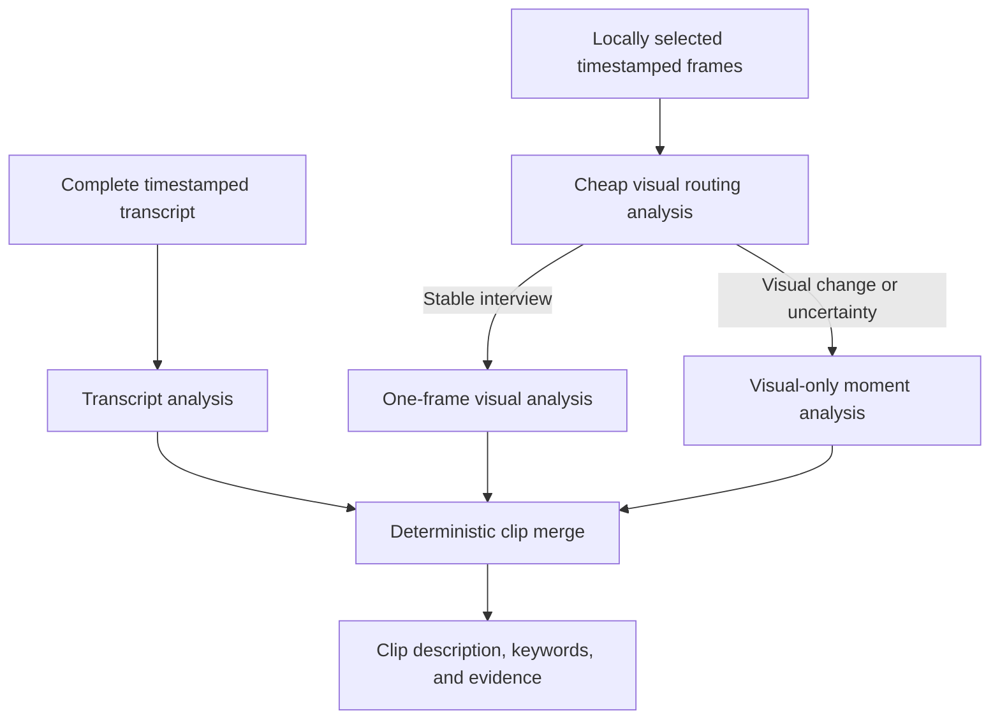

# Goal 3.1 — Transcript/Visual Analysis Separation

Status: implemented and deployed to `docubase-455a4`; real-footage threshold
calibration is pending before Goal 4 begins.

## Purpose

Refine Docubase's generated clip descriptions and tags so they are concise,
accurate, useful to documentary editors, and explicit about their evidence.
Transcript understanding and visual understanding must be independent inputs:



The transcript describes what is said across the clip. Screenshots describe
only what is visible. Neither source may be presented as evidence for a claim
that belongs to the other source.

## Current behavior to replace

The existing Goal 3 implementation:

- Adds nearby transcript excerpts to each 15-second visual-moment request.
- Gives the whole-clip request only an evenly sampled subset of the transcript.
- Generates one undifferentiated tag list from transcript and visual evidence.
- Sends multiple screenshots for visually static interviews.

This can produce screenshot-oriented clip summaries, miss the central spoken
subject, blur evidence provenance, and spend unnecessary image tokens.

## Goals

1. Analyze every substantive part of the transcript in chronological order.
2. Keep moment-level visual analysis strictly visual.
3. Produce short descriptions using an editorial hierarchy:
   footage type, central subject, main discussion/event, then useful visuals.
4. Generate a small, accurate set of editor-searchable keywords.
5. Analyze only one screenshot for a confidently detected, visually stable
   interview.
6. Preserve the adaptive multi-moment visual path for b-roll, action, mixed,
   changing, or uncertain footage.
7. Preserve evidence IDs, editor overrides, budget enforcement, idempotency,
   and resumability.
8. Avoid an additional generative request merely to combine two completed
   descriptions.

## Non-goals

- Face recognition, face clustering, or appearance-based identity.
- Voice identity across clips.
- Replacing the existing transcription provider.
- Semantic embeddings or hybrid search; those remain Goal 4.
- Inferring facts, names, relationships, intent, or locations without evidence.
- Uploading source video or retaining audio in Firebase.

## Definitions

- **Transcript analysis:** clip-wide analysis of all transcript utterances.
- **Visual routing analysis:** a low-cost decision using one representative
  frame, transcript-format output, and local visual-stability metrics.
- **Stable interview:** a clip that is both interview-like in speech and
  interview-like in appearance, with no evidence of important visual changes.
- **Visual moment:** a timestamped group of retained frames analyzed without
  transcript text.
- **Keyword:** a concise editor-searchable term grounded in transcript or frame
  evidence. The UI may continue to label keywords as tags.

## Target pipeline

### Stage 1 — Local frame extraction and stability metrics

Keep the current AVFoundation sampling and retained-frame generation. Extend
the media-worker result with clip-level stability signals calculated locally:

- `sampledFrameCount`
- `retainedFrameCount`
- `significantChangeCount`
- `significantChangeRatio`
- `medianChangeScore`
- `maximumChangeScore`

These values contain no biometric information. They measure pixel-level visual
change and do not identify people.

Choose one representative routing frame near the temporal midpoint from the
retained frames. If the midpoint frame cannot be decoded, use the nearest valid
retained frame. Keep all other retained images local until routing determines
that they are required.

### Stage 2 — Complete-transcript analysis

Run transcript analysis independently of visual analysis. Input utterances
must be ordered by `startMs` and include:

- Utterance ID
- Start and end timestamp
- Speaker label when available
- Complete utterance text
- Project brief, known names, and terminology
- Clip filename and duration

Every non-empty utterance must be represented once. Do not choose evenly spaced
utterances and do not silently drop the middle of a transcript.

#### Normal-size transcripts

Send the complete transcript in one structured Batch request when it fits
within configurable safety limits below both the model context window and the
Batch request-size limit. Calculate limits from serialized UTF-8 bytes and an
estimated token count rather than relying on utterance count alone.

#### Oversized transcripts

If the complete request exceeds a safety limit:

1. Split on utterance boundaries into deterministic, contiguous sections.
2. Analyze every section using the same transcript-only schema.
3. Require each section result to cite supplied utterance IDs.
4. Synthesize the final transcript analysis from all section analyses.
5. Preserve the union of underlying utterance evidence IDs.
6. Store section progress so an interrupted job does not repeat completed
   sections.

The hierarchical path is a size fallback, not a relevance sampler. It must
cover 100% of the transcript.

### Stage 3 — Cheap visual routing

Analyze the representative routing frame without transcript text. The visual
response classifies only visible composition, for example:

- `interview-like`
- `conversation-like`
- `presentation-like`
- `b-roll`
- `action`
- `archive`
- `establishing`
- `mixed-or-uncertain`

The routing decision then combines three independent signals:

1. Transcript analysis reports `interview` with high confidence.
2. The routing-frame analysis reports an interview-like composition with high
   confidence.
3. Local stability metrics remain within the tested stable-shot thresholds.

If all three pass, select `stableInterview`. Otherwise select `fullVisual`.
Uncertainty must always fall back to `fullVisual`; cost optimization must not
discard potentially useful changing visuals.

Thresholds must live in one named configuration object and have unit tests.
Initial values should be calibrated against real footage rather than scattered
as magic numbers through handlers.

### Stage 4A — Stable-interview visual path

For `stableInterview`:

- Use the already analyzed representative frame as the only Gemini image.
- Do not submit redundant 15-second visual-moment requests.
- Keep other extracted frames local; do not upload them unless a later manual
  full-analysis action is added.
- Create one clip-level visual record covering the clip duration.
- Preserve the representative frame timestamp and frame ID as evidence.
- Use transcript timestamps for spoken-topic navigation rather than fabricating
  repeated visual moments.

If later evidence indicates the clip was misclassified, the job can advance to
`fullVisual` without repeating transcript analysis or the routing frame.

### Stage 4B — Full visual path

For `fullVisual`:

- Upload the remaining retained frames.
- Group them into the existing approximately 15-second moments.
- Send only moment frames, valid frame IDs, timestamps, and project-level
  vocabulary to Gemini.
- Do not include transcript excerpts, transcript IDs, transcript summaries, or
  spoken topics in visual prompts.
- Reuse the routing-frame result when it corresponds to an existing moment.

Each result describes only visible evidence and returns visual keywords and
frame evidence IDs.

### Stage 5 — Deterministic clip merge

Combine completed transcript and visual records without another model request.

Description rules:

1. Lead with the transcript subject when substantive speech exists.
2. State the footage/speech format when it helps an editor distinguish the
   clip.
3. Append one concise sentence of useful visual context.
4. If there is no substantive speech, use the visual description alone.
5. If visual analysis is unavailable, use the transcript description alone.
6. Limit the final description to two sentences and 70 words.

Example:

> Interview footage in which a shelter worker recounts Max's adoption after
> 270 days at the shelter. A woman speaks while seated indoors in a simple
> interview setup.

Keyword rules:

- Merge transcript and visual keywords deterministically.
- Prefer accuracy over quantity.
- Remove case-insensitive duplicates and near-identical variants.
- Preserve supported proper-name capitalization.
- Put transcript subject/name keywords before visual-composition keywords.
- Do not include generic terms such as `video`, `person`, or `documentary`.
- Store provenance even though the UI displays one simple keyword list.
- Do not overwrite editor-modified descriptions or tags during refresh.

## Proposed stored contracts

Names may be adjusted to fit existing conventions, but the separation of
evidence is required.

```ts
type TranscriptSpeechFormat =
  | "interview"
  | "conversation"
  | "narration"
  | "presentation"
  | "production-chatter"
  | "no-substantive-speech"
  | "mixed"
  | "unknown";

interface ClipTranscriptAnalysis {
  clipId: string;
  summary: string;
  speechFormat: TranscriptSpeechFormat;
  subjects: string[];
  keywords: string[];
  namedEntities: string[];
  evidenceUtteranceIds: string[];
  confidence: number;
  analysisVersion: string;
  model: string;
}

type VisualComposition =
  | "interview-like"
  | "conversation-like"
  | "presentation-like"
  | "b-roll"
  | "action"
  | "archive"
  | "establishing"
  | "mixed-or-uncertain";

interface ClipVisualRoutingAnalysis {
  clipId: string;
  composition: VisualComposition;
  description: string;
  keywords: string[];
  evidenceFrameIds: string[];
  confidence: number;
  stability: {
    significantChangeRatio: number;
    medianChangeScore: number;
    maximumChangeScore: number;
  };
  route: "stableInterview" | "fullVisual";
}

interface GroundedKeyword {
  value: string;
  sources: Array<"transcript" | "visual" | "editor">;
  evidenceUtteranceIds: string[];
  evidenceFrameIds: string[];
}
```

Existing editor-facing `description: string` and `tags: string[]` fields remain
for compatibility. New generated fields and provenance sit beside them.

## Prompt specification

### Transcript prompt

```text
Analyze the complete transcript of this documentary clip for an editor.

Use every supplied transcript section as context, but summarize rather than
quote. Determine, in this order:
1. The speech/footage format.
2. The central subject.
3. The main event, account, argument, or discussion.
4. Important secondary subjects only when they materially distinguish the clip.

Ignore greetings, filler, false starts, interviewer logistics, production
chatter, and repeated takes when they are not the subject of the clip. Do not
invent facts or identify people unless supported by the transcript, known
names, or project brief.

Write one concise sentence, or two only when necessary, using no more than 55
words. Never use vague phrases such as "spoken documentary material." Never
quote isolated transcript fragments as the summary.

Generate 6-15 concise keywords an editor might type to retrieve this clip.
Prioritize supported names, organizations, subjects, events, locations, and
specific concepts. Prefer fewer accurate keywords over speculative, generic,
or redundant keywords.

Cite only supplied utterance IDs.
```

### Visual routing/frame prompt

```text
Analyze only what is visibly supported by this documentary frame. Do not infer
spoken topics, names, relationships, intent, or off-screen events.

Describe the visible composition in one concise sentence. Classify the
composition and generate 4-10 concrete visual keywords covering useful people
descriptors, actions, objects, setting, shot type, color, weather, or time of
day when clearly visible. Prefer accuracy over quantity and avoid generic terms.

Cite only supplied frame IDs.
```

### Visual-moment prompt

```text
Analyze only the supplied chronological frames from this short documentary
moment. No transcript evidence is provided, and the result must make only
visible claims.

Describe the dominant visible action and setting in concrete editor-friendly
language. Mention changes across frames only when visibly supported. Do not
infer names, dialogue, topics, locations, relationships, intent, chronology, or
off-screen events.

Generate 4-12 accurate visual keywords an editor might use to find this moment.
Cover specific actions, objects, setting, shot/content type, people descriptors,
weather, time of day, colors, and mood only when visibly supported. Prefer a
smaller accurate set over speculative or redundant keywords.

Cite only supplied frame IDs.
```

All prompts continue to use strict response schemas, low temperature, minimal
thinking, and evidence allowlists.

## UI behavior

The clip row should show:

1. The merged one- or two-sentence description.
2. A simple keyword list immediately below it.
3. A processing badge such as `Interview · one visual frame` or
   `Visual sequence · 12 moments` when useful.
4. Existing edit controls for description and tags.

The detailed view should distinguish:

- `From transcript`: summary, keywords, and utterance evidence.
- `From visuals`: description, keywords, and frame evidence.
- `Editor changes`: final overridden description or tags.

This provenance can be visually subtle; it exists to make incorrect AI output
diagnosable.

## State machine and idempotency

Use independently resumable stages:

```text
transcriptPending
→ transcriptAnalyzing
→ transcriptComplete

visualExtracting
→ routingFrameReady
→ routingAnalyzing
→ stableInterview | fullVisual
→ visualAnalyzing
→ visualComplete

transcriptComplete + visualComplete
→ merged
```

Requirements:

- Hash the complete transcript, frame set, prompt version, and routing
  configuration into job identity.
- A changed transcript invalidates transcript analysis and the merged result,
  but not unchanged visual analysis.
- Changed frames invalidate visual analysis and the merged result, but not
  unchanged transcript analysis.
- A prompt/schema version change creates a new generated result without
  overwriting editor values.
- Refresh must collect existing provider jobs before creating new work.
- Partial section, routing, or moment results remain recoverable.
- Reserve cost per independent provider stage and reconcile observed usage.

## Migration of existing Goal 3 records

1. Keep existing descriptions, tags, moments, and editor edits readable.
2. Mark legacy combined analysis as `analysisVersion: "3"`.
3. Introduce a new version for the separated pipeline.
4. Do not automatically reanalyze every existing clip on deployment.
5. Show `Rebuild analysis` for clips using the legacy version.
6. Reuse local frames, uploaded objects, transcripts, and valid visual evidence
   where doing so does not mix transcript claims into new visual records.
7. Preserve editor-authored values throughout migration.

## Implementation sections

### Section A — Contracts and transcript analysis

- Add the separated schemas and Firestore records.
- Replace transcript sampling with complete-transcript input.
- Add deterministic oversized-transcript partitioning and synthesis.
- Add the transcript editorial hierarchy and keyword instructions.
- Persist evidence and resumable section status.

Testable outcome: a completed transcript produces a concise transcript-only
summary and accurate keyword list covering the entire clip.

### Section B — Visual-only prompts and provenance

- Remove transcript data from `VisualMomentInput` and moment prompts.
- Update schemas so moment evidence contains frame IDs only.
- Strengthen visual keyword instructions.
- Store transcript and visual generated fields separately.

Testable outcome: visual descriptions cannot cite utterances or make claims
supported only by dialogue.

### Section C — Interview routing

- Add local stability metrics.
- Upload/analyze one representative routing frame first.
- Combine transcript format, visual composition, and stability conservatively.
- Implement one-frame and full-visual branches with resumable state.
- Reuse the routing result in the selected branch.

Testable outcome: a stable interview uses exactly one Gemini image while
visually changing or uncertain footage retains adaptive moment analysis.

### Section D — Merge, UI, and migration

- Deterministically merge descriptions and keywords.
- Display the simple keyword list and optional provenance.
- Preserve editor overrides.
- Add legacy-version detection and `Rebuild analysis` behavior.
- Update cost preflight to show the staged/routed estimate clearly.

Testable outcome: the clip table shows concise combined descriptions and useful
keywords without hiding which evidence source produced them.

## Test plan

### Unit tests

- Complete transcripts include the first, middle, and final utterances.
- Oversized splitting covers every utterance exactly once and preserves order.
- Synthesis accepts only evidence IDs emitted by completed sections.
- Visual prompt construction contains no transcript text or utterance IDs.
- Keyword normalization removes generic, duplicate, empty, and unsupported
  values.
- Deterministic merge obeys the 70-word/two-sentence limit.
- Editor values survive refresh and reanalysis.
- Routing thresholds choose `stableInterview` only when all signals pass.
- Any uncertain, conflicting, or changing signal chooses `fullVisual`.
- Job hashes change only when their relevant evidence or version changes.

### Provider/contract tests

- Malformed transcript, routing, and visual JSON is rejected.
- Evidence outside the corresponding allowlist is rejected.
- Transcript analysis cannot cite frame IDs.
- Visual analysis cannot cite utterance IDs.
- Partial Batch completion is resumable without duplicate submissions.
- Oversized transcript section failure can retry only the failed section.
- Actual usage reconciles all section and image requests.

### Real-footage evaluation set

Include at least:

- Static single-person interview.
- Two-person interview.
- Interview with camera-angle changes.
- Interview intercut with b-roll.
- Voice-over over changing b-roll.
- Silent b-roll.
- Action footage.
- Repeated takes and production chatter.
- Long interview that crosses the normal transcript request threshold.
- Clip with misleading filename or no project brief.

For each clip, record the expected format, central subject, essential keywords,
visual route, and at least one unacceptable speculative tag.

## Acceptance criteria

- 100% of transcript utterances are covered directly or through deterministic
  contiguous section analysis.
- Moment visual requests contain no transcript text or utterance IDs.
- Every transcript claim cites allowed utterance evidence.
- Every visual claim cites allowed frame evidence.
- Stable interviews send exactly one image to Gemini for visual analysis.
- Mixed, changing, and uncertain clips use the full visual path.
- Final descriptions are at most two sentences and 70 words.
- Generated keyword lists contain no generic placeholder tags and no evidence-
  unsupported proper names.
- Editor changes are never overwritten by refresh, retry, migration, or merge.
- Interrupted processing resumes without repeating completed paid stages.
- Preflight estimation and final reconciliation include every transcript
  section and image request.
- Existing Goal 3 projects remain readable without mandatory reanalysis.

## Recommended implementation order

Implement Sections A through D in order. Section A fixes summary quality without
waiting for the routing redesign. Section B restores evidence separation.
Section C provides the interview cost optimization. Section D completes the
editor-facing experience and migration.

Goal 4 should begin only after this milestone passes its real-footage evaluation
set, because hybrid search quality will depend directly on these descriptions
and keywords.
