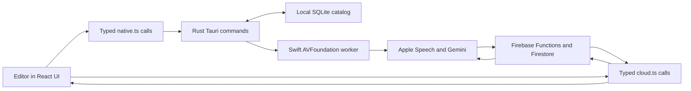

# Docubase architecture

This guide is the shortest path to understanding the codebase. Docubase uses
four languages, but each one has a narrow job:

| Layer | Language | Responsibility |
| --- | --- | --- |
| Desktop interface | TypeScript, React, CSS | Screens, user actions, validation, and orchestration |
| Desktop backend | Rust | SQLite, local files, resumable jobs, and Tauri commands |
| Media worker | Swift | AVFoundation inspection, audio extraction, and frame extraction |
| Cloud backend | TypeScript | Authentication checks, budgets, provider calls, and cloud persistence |

The small HTML and JavaScript files only start the app and build its native
helper. CSS is separate from TypeScript because it describes presentation,
not application behavior. Replacing Rust or Swift with Java would add a large
migration without removing these platform boundaries: Java would still need a
native media bridge and a desktop-to-backend bridge.

## Recommended reading order

Read these files in this order. You do not need to understand every helper on
the first pass.

1. [`PLAN.md`](./PLAN.md) explains what the product is meant to become.
2. [`src/lib/contracts.ts`](./src/lib/contracts.ts) defines the data that moves
   between layers. It is the vocabulary of the application.
3. [`src/App.tsx`](./src/App.tsx) is the entire top-level UI flow: configure,
   sign in, then open a workspace.
4. [`src/features/projects/Workspace.tsx`](./src/features/projects/Workspace.tsx)
   handles project selection, creation, synchronization, and deletion.
5. [`src/features/catalog/CatalogScreen.tsx`](./src/features/catalog/CatalogScreen.tsx)
   renders one project's footage catalog and connects user actions to workflows.
6. [`src/features/catalog/useTranscriptionWorkflow.ts`](./src/features/catalog/useTranscriptionWorkflow.ts)
   [`useVisualWorkflow.ts`](./src/features/catalog/useVisualWorkflow.ts), and
   [`useSemanticSearch.ts`](./src/features/catalog/useSemanticSearch.ts)
   contain the long-running workflows.
7. [`src/lib/native.ts`](./src/lib/native.ts) is the typed TypeScript boundary
   to Rust. [`src/lib/cloud.ts`](./src/lib/cloud.ts) is the boundary to Firebase.
8. [`src-tauri/src/lib.rs`](./src-tauri/src/lib.rs) registers the Rust commands.
   Continue into the Rust module named for the feature you are studying.
9. [`native/MediaWorker/Sources/MediaWorker/main.swift`](./native/MediaWorker/Sources/MediaWorker/main.swift)
   is the media worker's command-line entry point. The files in
   `MediaWorkerCore` contain the AVFoundation work.
10. [`functions/src/index.ts`](./functions/src/index.ts) lists every deployed
    cloud endpoint. Each implementation lives in a feature module beside it.

## End-to-end structure



Original footage stays on the editor's Mac. Rust stores paths and durable job
state in SQLite. Swift reads source video and creates temporary derivatives.
Only transcript records and approved retained thumbnails cross the Firebase
boundary.

## Frontend: `src/`

- `App.tsx` chooses the current top-level screen from Firebase auth state.
- `features/auth/` contains sign-in and configuration screens.
- `features/projects/` owns the project list and project dialogs.
- `features/catalog/` owns the footage table and coordinates feature workflows.
- `features/transcription/` renders transcript status and transcript contents.
- `features/visual/` renders frames, moments, analysis approval, and project
  context.
- `components/` contains genuinely shared interface pieces.
- `lib/contracts.ts` contains Zod schemas and their inferred TypeScript types.
- `lib/native.ts` wraps every Tauri command. UI code should not call `invoke`
  anywhere else.
- `lib/cloud.ts` wraps Firestore and callable functions. UI code should not
  construct cloud paths anywhere else.
- `lib/visual.ts` contains pure cost calculations that are easy to unit test.
- `styles.css` is only an import list. `styles/` follows the same feature split
  as the React code.

The two workflow hooks are state machines written in ordinary React. They load
durable state, advance one stage at a time, update progress, and leave recovery
information behind if the app closes.

## Desktop backend: `src-tauri/src/`

- `lib.rs` creates the app, initializes state, and registers commands.
- `models.rs` defines values serialized across the Tauri boundary.
- `database.rs` owns the SQLite schema and connection helper.
- `projects.rs` persists local project records.
- `catalog.rs` scans, fingerprints, relinks, and lists footage.
- `transcription.rs` runs transcription commands;
  `transcription/repository.rs` handles their SQLite records.
- `visual.rs` selects and stores visual evidence.
- `media.rs` launches the bundled Swift worker.
- `utilities.rs` contains only tiny shared helpers.

Rust owns local durability. A UI refresh should be able to rebuild its state
from these commands instead of relying on an in-memory operation having
finished.

## Media worker: `native/MediaWorker/`

- `main.swift` parses a small JSON command-line protocol.
- `MediaModels.swift` defines requests and responses.
- `MediaInspector.swift` reads metadata and extracts audio.
- `AppleSpeechTranscriber.swift` performs timestamped on-device transcription.
- `FrameExtractor.swift` samples and filters visual evidence.
- `TimecodeReader.swift` interprets source timecode metadata.

This code is Swift because AVFoundation is Apple's direct, reliable API for
camera formats and timecode. Rust starts the worker as a sidecar and decodes
its JSON response, keeping Apple-specific code out of the rest of the app.

## Cloud backend: `functions/src/`

- `index.ts` only exports deployable endpoints.
- `shared.ts` configures Firebase and contains common request validation.
- `usage.ts` reserves and reconciles provider costs.
- `projects.ts` uploads validated frames and deletes projects.
- `visual/submit.ts` and `visual/refresh.ts` submit and collect Gemini work.
- `visual/requests.ts` and `visual/validation.ts` build requests and validate
  model output.
- `budget.ts`, `clip-summary.ts`, and `gemini-response.ts` are pure domain
  helpers with direct tests.
- `semantic-search.ts` owns authenticated batch indexing and vector retrieval;
  `search-core.ts` contains the transcript-window and embedding-text rules that
  can be tested without Firebase.

Cloud Functions are security and billing boundaries for Gemini and protected
thumbnail storage. Membership checks, upload validation, and visual-analysis
cost reservations belong here rather than in the desktop UI.

## Three core workflows

### Import

1. `CatalogScreen` asks `native.ts` to scan a chosen folder.
2. Rust walks supported files, creates sampled fingerprints, and calls Swift.
3. Swift returns metadata and a local poster image.
4. Rust saves the catalog in SQLite.
5. The frontend syncs portable clip manifests to Firestore. Local paths and
   poster paths are removed before synchronization.

### Transcription

1. `useTranscriptionWorkflow` asks Rust to create deterministic 30-minute jobs.
2. Rust asks Swift to extract one temporary AAC chunk.
3. Swift transcribes the chunk on-device with Apple SpeechAnalyzer and returns
   timestamped text to Rust.
4. Rust normalizes and durably saves the local response.
5. The frontend saves the transcript to Firestore, marks the local job complete,
   and Rust deletes the temporary audio.

### Visual analysis

1. `useVisualWorkflow` asks Rust/Swift to select small representative frames
   and calculate clip-wide pixel-change stability metrics.
2. The editor sees count, bytes, and estimated cost before approving upload.
3. The desktop uploads only the midpoint routing frame initially.
4. A function reserves worst-case budget and submits independent complete-
   transcript and one-frame visual-routing Batch requests.
5. Stable interviews stop with that one Gemini image. Changing or uncertain
   clips upload the remaining frames and submit visual-only moment requests.
6. Refresh validates each source against its own evidence allowlist and merges
   the concise clip description and keywords without another model call.
7. The UI shows the merged result and can disclose separate transcript and
   visual provenance.

### Semantic search

1. The editor explicitly builds or updates a project's search index.
2. The function reads completed clip descriptions/tags, visual moments, and the
   complete timestamped transcript, then groups speech into roughly 45-second
   passages.
3. Each source becomes a retrieval-formatted Gemini Embedding 2 document.
   Discounted Batch jobs create separate 768-dimensional vectors and report
   completed/total job progress.
4. Completed vectors are written to the protected `searchDocuments`
   subcollection; stale documents are removed only after the rebuild succeeds.
5. A submitted query creates one standard embedding. Firestore Enterprise
   cosine search ranks All, Visual, or Spoken evidence, while an exact filename
   lookup is pinned in All.
6. The frontend renders the original stored evidence with a protected/local
   thumbnail, quote or description, tags, exact timecode, and Reveal in Finder.

## Important invariants

- Original video is never uploaded or copied into Docubase storage.
- Temporary audio is deleted after both local completion and cloud sync.
- Absolute paths and local poster paths never enter Firestore.
- Times crossing a code boundary are integer milliseconds unless a field name
  explicitly says otherwise.
- Clip IDs are derived from sampled file fingerprints, so relinking does not
  depend on an absolute path.
- Provider work is asynchronous and resumable. Refreshing should collect or
  retry an existing stage, not silently submit duplicate paid work.
- Model output is untrusted input. Cloud validation must resolve every evidence
  ID against evidence that was actually supplied.
- User-edited descriptions and tags take precedence over generated defaults.
- Search results never contain generated prose: every displayed description,
  tag, quote, filename, thumbnail reference, and timestamp comes from indexed
  project evidence.

## Changing a cross-layer type

Some concepts intentionally appear in more than one language. When changing a
field sent across a boundary:

1. Change its Zod schema in `src/lib/contracts.ts`.
2. Change the matching Rust type in `src-tauri/src/models.rs` if it crosses
   Tauri.
3. Change the matching Swift `Codable` type in `MediaModels.swift` if it crosses
   the worker protocol.
4. Change the cloud request/response type if it crosses a callable boundary.
5. Keep serialized field names in `camelCase`.
6. Add or update a test at the lowest layer that owns the behavior.

## Verification

Run focused tests while editing, then the complete suite before handing off a
change:

```sh
npm test
npm run build
npm --prefix functions test
npm run test:rules
npm run test:rust
npm run test:swift
npm run tauri:build
```

Unit tests sit beside TypeScript helpers, in `functions/test/`, in
`src-tauri/src/tests.rs`, and in `native/MediaWorker/Tests/`. Firestore and
Storage rule tests use local Firebase emulators and do not alter production
data.
