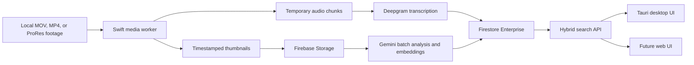

# Docubase Local-First Documentary Search MVP

## Summary

Build a macOS-first desktop app using Tauri 2, React, and TypeScript, with a small native Swift media worker. This is preferable to a browser-only app because ingest requires reliable filesystem access, long-running local processing, source timecode extraction, and resumable work on attached drives. The React interface can later be deployed as the web client.

Original video never leaves the workstation. Only compressed audio is sent directly to Deepgram, while selected 384-pixel thumbnails, transcripts, descriptions, tags, and embeddings are retained in Firebase. Contact sheets are generated from individual thumbnails when needed rather than stored as the canonical visual data.

## Implementation Changes

### Desktop ingest and local processing

- Create a Tauri/React desktop shell with a Swift Package Manager media worker using AVFoundation and Vision. AVFoundation supports asynchronous frame extraction at requested timestamps and constrained output sizes. [Apple frame-extraction documentation](https://developer.apple.com/documentation/avfoundation/creating-images-from-a-video-asset)
- Keep source paths, filesystem permissions, processing cache, face feature prints, and resumable job state in local SQLite. Cloud records store filenames, fingerprints, reel/timecode metadata, and per-device relink status—not absolute paths.
- Fingerprint clips using size, duration, media metadata, and hashes sampled from the file so renamed footage can be relinked without hashing terabytes in full.
- Extract source frame rate as a rational value, embedded starting timecode when available, and drop-frame status. Fall back to elapsed clip time when no source timecode exists.
- Extract 30-minute, 48 kbps mono AAC audio chunks. Send them directly from the Mac to Deepgram using a short-lived token minted by Firebase; delete each local chunk after its transcript is safely committed. Deepgram supports prerecorded local audio and temporary client tokens while keeping the permanent key server-side. [Prerecorded audio limits](https://developers.deepgram.com/docs/pre-recorded-audio), [temporary token authentication](https://developers.deepgram.com/guides/fundamentals/token-based-authentication)
- Use Nova-3 English with word timestamps, utterances, smart formatting, and diarization. Project-specific paid keyterm prompting remains off by default and is shown as an optional cost increase.
- Scan locally at roughly one low-resolution frame per second. Within each five-second bucket, retain the frame with the strongest visual change, skip near-duplicates, and force at least one frame every 30 seconds. This caps retention at 12 frames per minute while preserving more shot changes than fixed 30-second sampling.
- Group retained frames chronologically into approximately 15-second visual moments. Keep individual timestamps and images so results can point to an exact frame.
- Do not perform face detection or face clustering in Goal 3. Character names in
  clip analysis may come only from transcript evidence, the project brief, or
  editor-provided known names. Appearance-based identity work is deferred.

### Firebase and AI pipeline

- Deploy Firebase Authentication, Storage, Cloud Functions 2nd gen, Cloud Tasks, and Firestore Enterprise in `us-central1`. Use email/password authentication initially and model project membership as owner, editor, or viewer.
- Use Firestore Enterprise full-text and vector indexes, while hiding all search-specific queries behind a backend `searchProject` contract. Pipeline operations remain pre-GA, so this boundary allows later replacement without changing either client. [Firestore text search](https://firebase.google.com/docs/firestore/enterprise/text-search), [Enterprise pricing and status](https://firebase.google.com/docs/firestore/enterprise/pricing)
- Store:
  - Project brief, known names/terms, members, budget, processing status, and model versions.
  - Clip metadata, description, tags, transcript chunks, and processing stages.
  - Timestamped frames and 15-second moments with evidence, structured facets, and separate text/visual embeddings.
  - Confirmed people and aliases with links to supporting frames, clips, and utterances.
- Upload only retained JPEG thumbnails and compressed transcript/provider
  records. Because this project uses the named Firestore database `default`
  rather than `(default)`, Storage rules cannot read its membership documents.
  Route frame bytes through an authenticated callable that validates membership
  against the named database, and deny all direct client Storage access.
- Analyze the complete transcript and chronological visual frame groups in
  independent `gemini-3.5-flash-lite` Batch requests, using strict structured
  output for:
  - Setting, weather, time of day, dominant colors, mood, objects, actions, and visible people.
  - Content type such as interview, b-roll, archive, action, or establishing shot.
  - Transcript format, central subject, named entities, and spoken keywords.
  - Short visual-moment and clip descriptions with source-specific evidence IDs.
- Submit non-urgent image analysis, embedding, clip summaries, and project summaries through Gemini Batch, which costs 50% of interactive requests and targets completion within 24 hours. [Gemini Batch API](https://ai.google.dev/gemini-api/docs/batch-api)
- Use `gemini-embedding-2` at 768 dimensions:
  - Embed retained images directly for cross-modal visual retrieval.
  - Embed transcript/description text separately.
  - Embed search queries once and compare the same query vector against both indexes.
  - Record embedding model/version so a future model change triggers controlled reindexing. Gemini Embedding 2 supports text and images in one embedding space, with 768 dimensions recommended and comfortably below Firestore’s 2,048-dimension limit. [Gemini embeddings](https://ai.google.dev/gemini-api/docs/embeddings), [Firestore vector limits](https://firebase.google.com/docs/firestore/vector-search)
- Keep project-wide AI context generation out of the current product. Search and
  browsing use grounded clip descriptions, tags, moments, and transcripts.
- Make every stage independently idempotent and resumable: discovered, extracting, transcribing, uploading, analyzing, embedding, indexed, or failed. Local stages resume when the desktop app reopens; cloud stages continue after derivatives are uploaded.

### Search, editing, and public contracts

- Provide four search scopes: All, Visual, Spoken, and Filename.
- Provide filter chips for person, topic, content type, talking/non-talking, indoor/outdoor, weather, time of day, color, mood, and action.
- Run filename/full-text, transcript-vector, and image-vector searches concurrently. Pin exact filename matches, then combine remaining results with deterministic reciprocal-rank fusion. A chosen scope disables irrelevant branches; confirmed-person matches receive a boost.
- Do not call a generative model to compose ordinary search results. Every result must be grounded in stored evidence and return:
  - Clip ID/name and match reason.
  - Best thumbnail and its precise timestamp.
  - Verbatim stored transcript excerpt and speaker/person attribution when available.
  - Embedded recording date plus source timecode or elapsed time in evidence views.
  - Reveal in Finder and Copy Timecode actions.
- The main project screen is a virtualized clip table with thumbnail, name, duration, description, tags, status, expandable transcript, and editable metadata.
- Preserve raw generated values and provenance while allowing editors to revise transcript utterances, descriptions, tags, people, topics, and storylines. Transcript edits occur at utterance level so start/end timestamps remain intact.
- Define shared validated contracts for:
  - `ClipManifest`, `IngestEstimate`, `ProcessingStage`, `FrameEvidence`, `TranscriptUtterance`, `IndexedMoment`, and `UsageEvent`.
  - `SearchRequest { projectId, query, scopes, filters, limit, cursor }`.
  - `SearchHit { clipId, momentId, matchKinds, thumbnail, quote, timestamp, sourceTimecode, score }`.
- Implement authenticated backend operations for project creation/membership, ingest estimation, Deepgram token minting, transcript completion, analysis scheduling/status, project search, entity confirmation, metadata revision, and project deletion.

### Security and cost controls

- Keep Deepgram and Gemini credentials in Google Secret Manager. Every function validates Firebase identity, project membership, requested duration, and remaining project budget.
- Reserve estimated cost atomically before creating provider work, then reconcile against actual usage. Stop new work and request approval when reserved plus actual usage would exceed `footage duration × $0.50`.
- Add per-user and per-project concurrency limits, Storage/Firestore security rules, audit records, and alerts at 50%, 80%, and 100% of the configured cloud budget.
- Expect approximately $0.408 per footage hour for Nova-3 plus diarization at current pay-as-you-go rates, leaving roughly $0.09/hour for batched Gemini work. [Current Deepgram pricing](https://deepgram.com/pricing), [current Gemini pricing](https://ai.google.dev/gemini-api/docs/pricing)
- Target at most 15 MB of retained cloud derivatives per footage hour. One hundred hours should therefore retain roughly 1.5 GB or less, while temporary audio transfer to Deepgram is approximately 2.2 GB and is never persisted in Firebase.

## Test Plan and Acceptance Criteria

- Unit-test clip fingerprints, relinking, frame selection/deduplication, transcript overlap merging, source timecode conversion—including 23.976 and 29.97 drop-frame—and the resumable job state machine.
- Contract-test malformed Deepgram/Gemini responses, expired tokens, batch partial failures, provider rate limits, duplicate callbacks, interrupted uploads, and budget exhaustion.
- Test MOV, MP4, and ProRes clips with multi-speaker audio, silent footage, missing timecode, rotated video, variable frame rate, long clips requiring multiple audio chunks, and moved or disconnected source drives.
- Test Firebase rules in the Emulator Suite for owner/editor/viewer isolation and verify that source-video and audio objects are rejected by Storage rules.
- Build a gold evaluation set from an under-10-hour real project with at least 25 searches spanning filename, spoken quote, named person, visual action, combined visual/topic query, and filters.
- Acceptance targets:
  - 100% exact filename retrieval.
  - At least 80% of gold moments in the top five results.
  - Every quote and timestamp resolves to stored evidence; no generated quotes.
  - Warm search p95 under three seconds and cold search under eight seconds.
  - Quit/network interruption resumes without reprocessing completed stages.
  - No original video appears in network traces or Firebase Storage.
  - Preflight and reconciled provider cost remain at or below approximately $0.50 per footage hour unless explicitly approved.

## Iterative Delivery Goals

### Goal 1 — Local catalog and secure project shell

Status: implemented and deployed for the `docubase-455a4` validation project.

Deliver a usable macOS desktop catalog before introducing paid media APIs:

- Email/password authentication and project creation against `docubase-455a4`.
- A local SQLite catalog that is the only place absolute source paths are kept.
- In-place recursive import of MOV, MP4, M4V, and ProRes-in-MOV footage.
- Fast sampled content fingerprints, duration, rational frame rate, embedded
  source timecode/drop-frame status, codecs, orientation-aware dimensions, and a
  compact local poster frame.
- A searchable clip table with Reveal in Finder, Copy Timecode, import progress,
  failure visibility, and content-fingerprint folder relinking.
- Firebase sync for project data and portable clip metadata only, protected by
  tested membership rules.

Goal 1 is testable with a folder containing representative camera files. It is
usable as a metadata catalog even before transcription or AI analysis exists.
Acceptance is: the signed-in editor can create a project, import media without
uploading source video, restart the app without losing the catalog, move the
folder, relink it, reveal a clip, and copy correct 23.976/25/29.97 drop-frame
source timecode.

### Goal 2 — Cost-controlled transcription

Status: implemented and deployed to `docubase-455a4`.

Add resumable local extraction of 30-minute mono AAC chunks, short-lived
Deepgram credentials, Nova-3 transcription with utterance/word timestamps and
diarization, transcript storage, expandable transcript rows, usage reservation,
and interruption recovery. Goal 2 is usable as a dialogue/quote finder and is
accepted against multi-speaker, silent, long, and interrupted clips with no
audio retained in Firebase.

Implemented scope:

- AVFoundation extracts 16 kHz mono AAC at 48 kbps into deterministic,
  fingerprinted local cache paths.
- SQLite persists per-chunk extraction, transcription, sync, completion, and
  failure state plus normalized utterances and words.
- The desktop uploads temporary audio directly to Deepgram Nova-3 using a
  five-minute token minted by Firebase; the permanent key remains in Secret
  Manager.
- Callable functions validate project membership, synced clip metadata, exact
  chunk boundaries, and the configured per-footage-hour budget before reserving
  cost. Completion is idempotent and creates a server-owned usage event.
- Firestore stores chunk metadata and timestamped transcript evidence, while
  security rules reject audio/local paths and protect usage records.
- The clip table includes status, bulk and per-clip actions, a cost-confirmation
  dialog, expandable speaker/timecode rows, quote search, and retries.
- Completed audio is deleted; extracted and syncing stages are reusable after an
  interruption. A failure after Deepgram accepts audio but before its response
  is durably saved can still require one paid chunk retry.

### Goal 3 — Visual moments and clip descriptions

Status: implemented and deployed to the `docubase-455a4` Firebase project.
Firestore and Storage rules are live, the Gemini secret is configured, and the
Goal 3 callable functions run in `us-central1`.

Add local frame selection/deduplication, retained low-resolution thumbnails,
15-second moment grouping, Gemini Batch visual analysis, structured facets,
and editable clip descriptions/tags.
Face clustering is deliberately excluded. Goal 3 is usable as a browsable
visual index and accepted only when every generated claim points to stored
frame or utterance evidence.

Implemented scope:

- AVFoundation samples at roughly one frame per second, keeps the strongest
  change in each five-second bucket, rejects near-duplicates, and forces a
  frame at least every 30 seconds. Output is orientation-correct, at most
  384 px, adaptively compressed below 100 KB, and capped at 12 frames/minute.
- SQLite stores resumable per-clip visual stages and exact frame timestamps.
  Reopening the app reuses retained frames and already-uploaded objects.
- A cost dialog is shown after free local extraction and before network work.
  Only approved retained JPEGs are uploaded; source video remains local.
- An authenticated callable validates project membership against the named
  Firestore database, exact object paths, JPEG bytes, frame size, and clip
  duration before storing each frame. Direct Storage client access is denied.
- Authenticated analysis functions pool visual allowance across the project's
  full footage duration, subtract completed and reserved Gemini work, and apply
  a one-cent floor for tiny projects with fixed Batch overhead before
  submitting `gemini-3.5-flash-lite` jobs.
- Every 15-second moment uses strict structured output for description, tags,
  setting, weather, time of day, colors, mood, objects, actions, people
  descriptors, content type, and speech state. Output evidence IDs are checked
  against stored frame and utterance IDs before any result is accepted.
- Whole-clip descriptions use a separately estimated Batch request with up to
  eight frames and transcript evidence sampled across the clip. The prompt
  prioritizes subject matter and editorial context instead of enumerating
  screenshots, is capped at two sentences/70 words, and rejects transcript
  quotation, filler, production chatter, and repeated takes. Existing paid jobs
  receive a free concise topic-and-visual fallback; editors can revise
  descriptions and tags without a later refresh overwriting their changes.
- Batch jobs, result collection, and usage reconciliation are idempotent.
  Partial result collection remains refreshable and reuses the original paid
  Batch responses without creating a second reservation. Batch response text
  is read from candidate parts, and legacy alternate-key responses are accepted
  only after their cited frame IDs pass the normal evidence allowlist.
- Submission claims are persisted before provider work, each created Batch is
  checkpointed immediately, terminal failure in one Batch no longer discards
  successful sibling batches, and the job fingerprint includes the transcript
  plus analysis version so changed evidence cannot silently reuse stale output.
- Project owners can permanently delete cloud records, retained thumbnails,
  and the local catalog/cache after typed-name confirmation. Original footage
  is excluded, and active Gemini Batch cancellation is attempted first.

### Goal 3.1 — Separate transcript and visual analysis

Status: implemented and deployed to `docubase-455a4`; real-footage calibration
remains before this milestone is considered production-validated.

Refine Goal 3 before building hybrid search. Analyze the complete transcript in
an independent transcript pipeline, keep moment analysis strictly visual,
generate stronger evidence-backed clip keywords, and use one Gemini screenshot
for confidently detected visually stable interviews. Preserve the adaptive
visual-moment path for mixed, changing, or uncertain footage. The full
implementation specification, migration strategy, and acceptance tests are in
[ANALYSIS_PIPELINE_SPEC.md](./ANALYSIS_PIPELINE_SPEC.md).

Implemented scope includes deterministic full-transcript partitioning,
transcript-only and visual-only schemas, a one-frame conservative interview
router driven by AVFoundation stability metrics, deferred upload of remaining
frames, deterministic description/keyword merging, provenance display,
editor-override preservation, and legacy Goal 3 rebuild controls.

### Goal 4 — Grounded hybrid search

Add text/image embeddings, Enterprise full-text and vector indexes, the
backend-owned `searchProject` contract, reciprocal-rank fusion, All/Visual/
Spoken/Filename scopes, category filters, evidence thumbnails, transcript
quotes, precise timestamps, and source timecode. Goal 4 is usable as the core
documentary retrieval product and is accepted against the gold query set and
latency/relevance targets above.

### Goal 5 — Scale, collaboration, and distribution

Add editor/viewer roles, invitations, quotas and alerting, audit history,
App Check enforcement, large-project operational tests,
observability, signed/notarized universal macOS builds, and a deployment
runbook. Goal 5 is accepted when a second editor can safely collaborate and the
app can be distributed outside the development Mac without exposing provider
credentials or local media.

## Assumptions and Deferred Work

- The first local build targets the current Apple-silicon Mac, English-language MOV/MP4/ProRes footage, and one under-10-hour validation project.
- Local unsigned development requires no paid Apple developer membership. Signing and notarization are deferred until distributing the app to other editors.
- Face clustering is not part of the current product. Off-camera speakers
  cannot be reliably recognized across clips without future voice clustering.
- The desktop app must remain open for local extraction and direct Deepgram uploads; Firebase/Gemini processing may continue after it closes.
- The first milestone excludes Windows, browser access, source-video playback, stored audio proxies, Premiere/Resolve/Final Cut integration, and interchange export. It supports Reveal in Finder and Copy Timecode only.
- App Check enforcement and a universal signed installer follow the validated vertical slice; authentication, authorization, quotas, and server-side secrets are included immediately.
